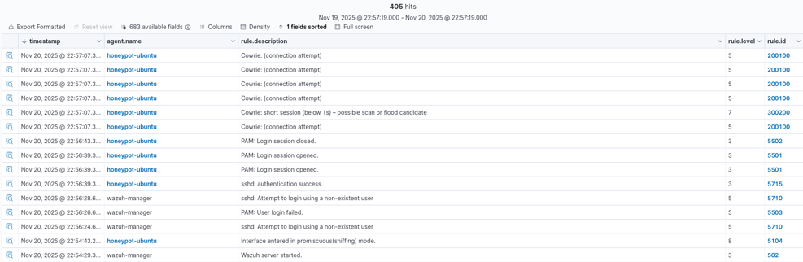
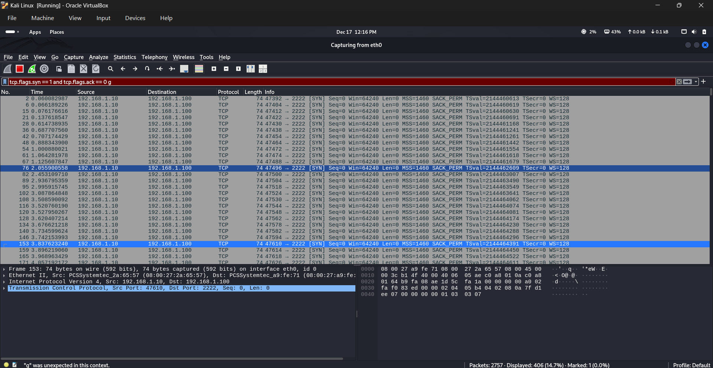

# brute-force-attack-recording-using-wazuh

## 1. PING EACH MACHINE TO OTHER MACHINE

### A.Kali Linux (Attacker)

### b.Honeypot Ubuntu

### B.Wazuh Manager

## 2. BRUTE FORCE ATTACK TEST
USING : hydra -l root -x 4:6:a ssh://192.168.1.100:2222

## 3. WAZUH DASHBOARD DISPLAY

## 4. WIRESHARK DISPLAY
USING : ip.src == 192.168.1.10 && tcp.port == 2222 

USING : tcp.flags.syn == 1 and tcp.flags.ack == 0

